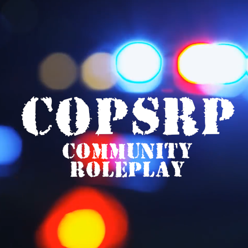

# 🚔 Wiki.CopsRP.COM

     

## CopsRP Wiki

Creating a RolePlay Community and Server for Everyone can contribute to the CopsRP community in Someway whether that be Developing, Donating or Just Playing its All welcome this wiki will be a place for guides to be added quickly and easily by members of the community and take a load of the Development team\
[**Explore the docs »**](https://github.com/mrdiamonddirt/CopsRP\_Wiki)\
\
[View Demo](https://github.com/mrdiamonddirt/CopsRP\_Wiki) · [Report Bug](https://github.com/mrdiamonddirt/CopsRP\_Wiki/issues) · [Request Feature](https://github.com/mrdiamonddirt/CopsRP\_Wiki/issues)

Table of Contents

1. [About The Project](./#about-the-project)
   * [Built With](./#built-with)
2. [Getting Started](./#getting-started)
   * [Prerequisites](./#prerequisites)
   * [Installation](./#installation)
3. [Usage](./#usage)
4. [Roadmap](./#roadmap)
5. [Contributing](./#contributing)
6. [License](./#license)
7. [Contact](./#contact)
8. [Acknowledgments](./#acknowledgments)

About The Project

([back to top](./#readme-top))

#### Getting Started

This is an example of how you may give instructions on setting up your project locally. To get a local copy up and running follow these simple example steps.

#### Usage

Use this space to show useful examples of how a project can be used. Additional screenshots, code examples and demos work well in this space. You may also link to more resources.

_For more examples, please refer to the_ [_Documentation_](https://example.com)

([back to top](./#readme-top))

#### Roadmap

* [x] Create CopsRP Wiki
* [x] Create Github Repo
* [x] Start CAD Development
  * [x] Start Beta Testing App and finding flaws / Bugs
  * [ ] Add More Apps to Desktop Environment
* [ ] Invite Contributors
  * [ ] Expand on The Wiki
  * [ ] Expand on the Github Repo
* [ ] Create more detailed Graphical Roadmap

See the [open issues](https://github.com/mrdiamonddirt/CopsRP\_Wiki/issues) for a full list of proposed features (and known issues).

([back to top](./#readme-top))

#### Contributing

Contributions are what make the open source community such an amazing place to learn, inspire, and create. Any contributions you make are **greatly appreciated**.

If you have a suggestion that would make this better, please fork the repo and create a pull request. You can also simply open an issue with the tag "enhancement". Don't forget to give the project a star! Thanks again!

1. Fork the Project
2. Create your Feature Branch (`git checkout -b feature/AmazingFeature`)
3. Commit your Changes (`git commit -m 'Add some AmazingFeature'`)
4. Push to the Branch (`git push origin feature/AmazingFeature`)
5. Open a Pull Request

([back to top](./#readme-top))

#### License

Distributed under the MIT License. See `LICENSE.txt` for more information.

([back to top](./#readme-top))

#### Contact

Your Name - [@mrdiamonddirt](https://twitter.com/mrdiamonddirt) - mrdiamonddirt@Gmail.com

Project Link: [https://github.com/mrdiamonddirt/CopsRP\_Wiki](https://github.com/mrdiamonddirt/CopsRP\_Wiki)

([back to top](./#readme-top))

#### Acknowledgments

* [The FiveM and CFX team without them the server wouldn't be possible](https://https/forum.cfx.re/)
* [The QBCore Development Team because they have taught me so much and the server is built upon QBCore as a Base](https://docs.qbcore.org/qbcore-documentation/)
* [The CopsRP.com Roleplay Community for the help and support over the past 5 years, Thank You](https://www.copsrp.com)

([back to top](./#readme-top))
